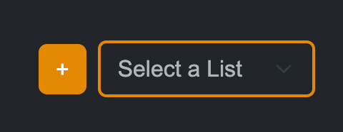
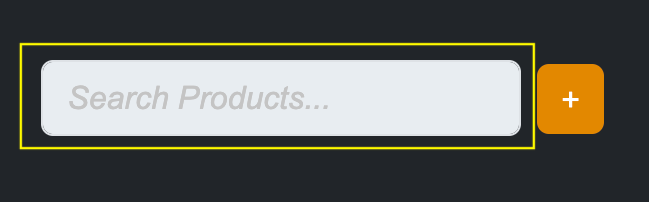
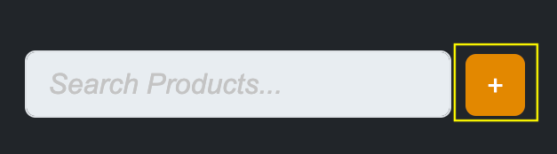
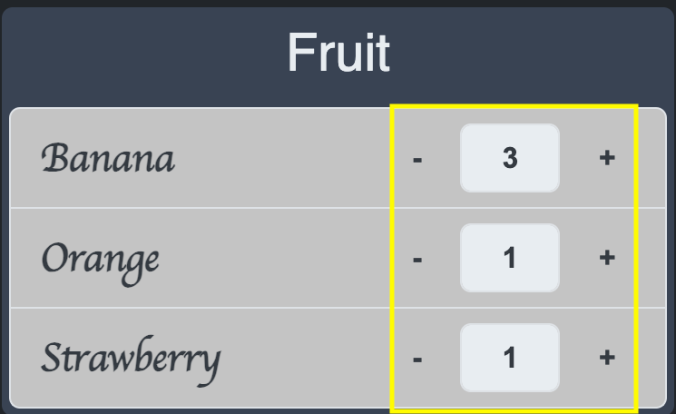

# Go Go Grocery

https://go-go-grocery.onrender.com/

## Description

The motivation behind this project was to create a interactable grocery list manager.  A user can create many lists, adding any available products to each list.  If a product does not exist, they can also add a new product!

## Usage

First, create a user and log in.

Start a new list by pressing the orange plus button on the left of the dropdown.

Add products to the list by searching for them in the search bar.

Create a new product if what you're looking for doesn't exist.

Change the quantity of each product by interacting with the plus and minus buttons, or inputing a new value.

## Future Development

Future updates will include:
- Mobile friendly layout
- Suggested products
- Share lists with other users
- Collapsible and more organized lists

## Credits

### Collaborators:
- [Nattan Aguia Trujillo](https://github.com/nattanaguiat)
- [Jordan Lorts](https://github.com/JL-Code1)
- [Mauricio Martinez](https://github.com/mauriciomdlg)
- [Jason Cable](https://github.com/cablej02)
